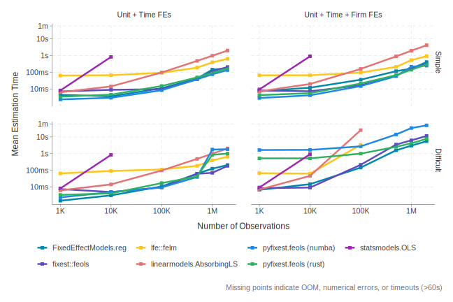
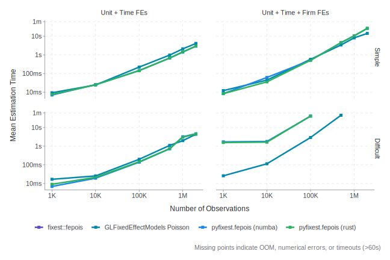

# Benchmarks for Fixed-Effect Estimation

This repository contains a set of open-source benchmarks for assessing
the performance of various statistical packages for estimating linear
and generalized linear models. The benchmarks are designed to evaluate
the speed and efficiency of different estimation methods under various
conditions, such as sample size, number of fixed effects, and model
complexity. These benchmarks are scheduled to run weekly on Github
Actions, and the updated results are stored in the `results` directory.

If you would like to contribute to the benchmarks or add alternative
estimators, PRs are welcome. The code `bench.R` is easily adaptable to
include additional estimators. Simply add a timer function to `timers.R`
that returns the time taken to estimate a model using your preferred
package. Then add your estimator to the `bench.R` file and submit a PR
for review.

> [!CAUTION]
>
> As with all benchmarks, these results should be interpreted with
> caution. Performance can vary based on the specific data, model
> specifications, number of cores and RAM available, and other aspects
> of computational environment. Github Actions likely use more limited
> resources than a high-end local machine. But, we use Github Actions to
> ensure that the benchmarks are run in a consistent environment so that
> individuals can use these benchmarks as a potential dev tool.

## Setup

### Prerequisites

You need the following installed on your system:

- **R** (>= 4.4.0)
- **Python** (>= 3.13)
- **Julia** (>= 1.11)
- **[just](https://github.com/casey/just)** - command runner
- **[uv](https://github.com/astral-sh/uv)** - Python package manager

### Installation

Install all dependencies with:

```bash
just setup
```

This runs:
- `renv::restore()` to install R packages from `renv.lock`
- `uv sync` to install Python packages from `pyproject.toml`
- `Pkg.instantiate()` to install Julia packages from `Project.toml`

### Running Benchmarks

```bash
# Run all simulated data benchmarks
just bench-all

# Run individual benchmarks
just bench-ols
just bench-poisson
just bench-logit

# Download real datasets and run all benchmarks
just run-all

# Generate summary plots and tables
just summarize
```

Run `just` to see all available commands.

## Simulation DGP

The code below is used to generate the simulated data for the
benchmarks. The function creates a balanced panel of individuals over a
specified number of years. Additionally workers are assigned to firms.
There are three fixed effects: individual, firm, and year.

How the firms are assigned to individuals can be controlled by the
`type` argument. In the `simple` case, individuals are assigned to firms
randomly. This creates a very “dense” network of individuals and firms
so estimation is relatively fast.

In the `difficult` case, individuals are assigned to firms so as to
create a very “sparse” network. This makes estimation more difficult and
time-consuming. These can be seen as two extreme cases and where a
particular dataset may fall depends on the specific application.


<details closed>
  <summary>DGP Code</summary>
  
``` r

base_dgp <- function(
  n = 1000,
  nb_year = 10,
  nb_indiv_per_firm = 23,
  type = c("simple", "difficult")
) {
  nb_indiv = round(n / nb_year)
  nb_firm = round(nb_indiv / nb_indiv_per_firm)
  indiv_id = rep(1:nb_indiv, each = nb_year)
  year = rep(1:nb_year, times = nb_indiv)

  if (type == "simple") {
    firm_id = sample(1:nb_firm, n, TRUE)
  } else if (type == "difficult") {
    firm_id = rep(1:nb_firm, length.out = n)
  } else {
    stop("Unknown type of dgp")
  }

  x1 = rnorm(n)
  x2 = x1**2

  firm_fe = rnorm(nb_firm)[firm_id]
  unit_fe = rnorm(nb_indiv)[indiv_id]
  year_fe = rnorm(nb_year)[year]
  mu = 1 * x1 + 0.05 * x2 + firm_fe + unit_fe + year_fe

  df = data.frame(
    indiv_id = indiv_id,
    firm_id = firm_id,
    year = year,
    x1 = x1,
    x2 = x2,
    y = mu,
    negbin_y = MASS::rnegbin(exp(mu), theta = 0.5),
    binary_y = as.numeric(mu > 0),
    ln_y = log(abs(mu) + 1)
  )
  return(df)
}
```
</details>


### OLS Results



### Poisson Results



### Logistic Results


### Real Data

<!-- Real Data -->
| Dataset           | Num. obs. | Estimator             | Mean Estimation Time |
|-------------------|-----------|-----------------------|----------------------|
| tradepolicy (OLS) | 28566     | pyfixest.feols        | 0.233                |
| tradepolicy (OLS) | 28566     | FixedEffectModels.reg | 0.125                |
| tradepolicy (OLS) | 28566     | fixest::feols         | 0.045                |
| nycflights13      | 336776    | pyfixest.feols        | 0.25                 |
| nycflights13      | 336776    | FixedEffectModels.reg | 0.121                |
| nycflights13      | 336776    | fixest::feols         | 0.107                |
| Medicare Provider | 9714896   | FixedEffectModels.reg | 12.124               |
| Medicare Provider | 9714896   | fixest::feols         | 32.196               |
| nyc taxi          | 46099576  | pyfixest.feols        | 59.238               |
| nyc taxi          | 46099576  | FixedEffectModels.reg | 21.502               |
| nyc taxi          | 46099576  | fixest::feols         | 47.661               |
<!-- Real Data -->
